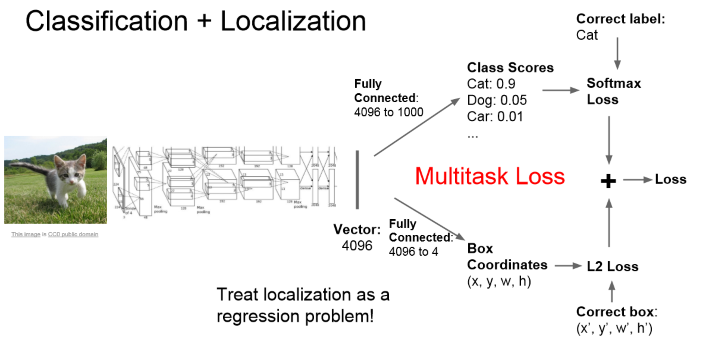

# Deep Learning for Visual Computing

This repository contains coursework and projects from the **Deep Learning in Visual Computing** course. The course provides a comprehensive overview of deep learning applications in visual computing, including foundational concepts and practical implementations. 

## Course Overview

This course covers:

- **Basics of Deep Learning**: Fundamental concepts such as optimization, network architecture, and training best practices.
- **Selected Applications**: Exploration of deep learning applications like image/video classification, object detection, semantic segmentation, and point cloud segmentation. The specific applications may vary with each course offering, reflecting the latest research papers in computer vision and computer graphics.

## Course Goals

1. Understand the basics of deep neural networks and their training processes.
2. Learn how to apply neural networks to solve visual computing problems.
3. Implement neural networks for practical applications in visual computing.

## Paper Discussion:

- [A Comparative Study of AlexNet and ResNet](paper_discussions/1_Comparative_study_AlexNet_ResNet.pdf)
- [A Comparative Study of YOLO and DeepLabv3 for Object Detection and Image Segmentation Tasks](paper_discussions/2_Comparative_Study_YOLO_DeepLabv3.pdf)
- [Exploring Recurrent Neural Networks, LSTMs, and Transformers in Deep Learning](paper_discussions/3_Exploring_RNN_LSTM_Transformers.pdf)
- [Transformers for Object Detection and Object Queries in DETR](paper_discussions/4_Exploring_Transformers_ObjectDetection.pdf)
- [Generative Adversarial Networks](paper_discussions/5_Exploring_GANs.pdf)
- [Exploring 3D Deep Learning PointNet and DGCNN](paper_discussions/6_Exploring_3D_DeepLearning.pdf)

## Projects:
## 1. [PyTorch and Deep Learning](projects/P1.David.Alvear.V1.ipynb)
### **Regression**
- Gradient Descent
- Torch optimizer
### **Image Classification**
- Logistic Regression
- Softmax and Cross-Entropy
- Convolutional Neural Networks
<table>
<tbody>
    <tr>
    <td></td>
    <td></td>
    <td></td>
    <td></td>
    </tr>
    <tr>
    <td>No padding, no strides</td>
    <td>Arbitrary padding, no strides</td>
    <td>Half padding, no strides</td>
    <td>Full padding, no strides</td>
    </tr>
    <tr>
    <td></td>
    <td></td>
    <td></td>
    <td><h5><i><b>Source:</b> <a href="https://github.com/vdumoulin/conv_arithmetic">vdumoulin</a></i></h5></td>
    </tr>
    <tr>
    <td>No padding, strides</td>
    <td>Padding, strides</td>
    <td>Padding, strides (odd)</td>
    <td></td>
    </tr>
</tbody>
</table>

### **Video Classification**
- YouTube-8M Dataset
- Classification using Video Features
### **Vision Transformer - Pathchify Images**

## 2. [Object Detection, Segmentation and Data augmentation](projects/P2.David.Alvear.V1.ipynb)
### **Semantic Segmentation**
### **U-Net, Seg-Net Based Implementation**
### **FCN-8s and Finetunning**
### **Object Detection and Localization YOLOv3**

### **Design Attention Blocks for Vision Transformer**

## 3. [Recurrent Neural Networks and Transformers](projects/P3.David.Alvear.V1.ipynb)

### **Recurrent Neural Networks**

### **Image Classification using GRU-based Classifier**

$$r_t = \sigma\left((\mathbf{W}_{ir}\mathbf{x}_t+\mathbf{b}_{ir}) + (\mathbf{W}_{hr}\mathbf{h}_{t - 1}+\mathbf{b}_{hr})\right)  \text{ (reset gate)}$$
$$z_t = \sigma\left((\mathbf{W}_{iz}\mathbf{x}_t+\mathbf{b}_{iz}) + (\mathbf{W}_{hz}\mathbf{h}_{t - 1}+\mathbf{b}_{hz})\right)  \text{ (update gate)}$$
$$n_t = \tanh\left((\mathbf{W}_{in}\mathbf{x}_t+\mathbf{b}_{in}) + r_t \odot (\mathbf{W}_{hn}\mathbf{h}_{t - 1}+\mathbf{b}_{hn})\right)  \text{ (new gate)}$$
$$h_t = (1 - z_t) \odot n_t + z_t \odot h_{t - 1}  \text{ (hidden state)}$$

### **Build a ViT Model for Image Classification**

## 4. [Generative Models](projects/P4.David.Alvear.V1.ipynb)

$$p(\mathbf{x}, \mathbf{z}) = \overset{\text{encoder}}{\overbrace{p(\mathbf{z}|\mathbf{x})}}p(\mathbf{x}) = \overset{\text{decoder}}{\overbrace{p(\mathbf{x}|\mathbf{z})}}\underset{\text{prior}}{\underbrace{p(\mathbf{z})}}$$

### **Variational Auto-Encoders**

Loss Function VAE:

$$\mathcal{L}_{\beta\text{-VAE}}(\mathbf{x}) = \overset{\text{reconstruction term}}{\overbrace{\underset{\mathbf{\hat{x}} \rightarrow \mathbf{x}}{\underbrace{\|\mathbf{\hat{x}} - \mathbf{x}\|_2^2}}}} + \beta \overset{\text{regularization term}}{\overbrace{\sum_i(\underset{\mathbf{\mu} \rightarrow \mathbf{0}}{\underbrace{\mathbf{\mu}^2}} + \underset{\mathbf{\sigma^2} \rightarrow \mathbf{1}}{\underbrace{\mathbf{\sigma}^2 - \log \mathbf{\sigma}^2 - \mathbf{1}}})_i}}$$

### **Generative Adversarial Networks**

Min-Max problem:

$$\min_G \max_D \mathbb{E}_{\mathbf{x} \sim p(\mathbf{x})}[\log D(\mathbf{x})] + \mathbb{E}_{\mathbf{z} \sim p(\mathbf{z})}[\log(1 - D(G(\mathbf{z})))]$$

Discriminator and Generator:

$$\mathcal{L}^\text{GAN}_G(\mathbf{z}) = \mathbb{E}_{\mathbf{z} \sim p(\mathbf{z})}[\log(1 - D(G(\mathbf{z})))]$$
$$\mathcal{L}^\text{GAN}_D(\mathbf{x}) = -\mathbb{E}_{\mathbf{x} \sim p(\mathbf{x})}[\log D(\mathbf{x})] - \mathbb{E}_{\mathbf{z} \sim p(\mathbf{z})}[\log(1 - D(G(\mathbf{z})))]$$

### **Adversarial Attacks**

## 5. [3D Deep Learning, PointNet, Zero-Shot prediction](projects/P5.David.Alvear.V1.ipynb)

### **3D Representations**

### **PointNet Implementation**

### **Graph Convolutional Networks - DGCNN**

### **Zero-shot Point Cloud Classification using CLIP**

